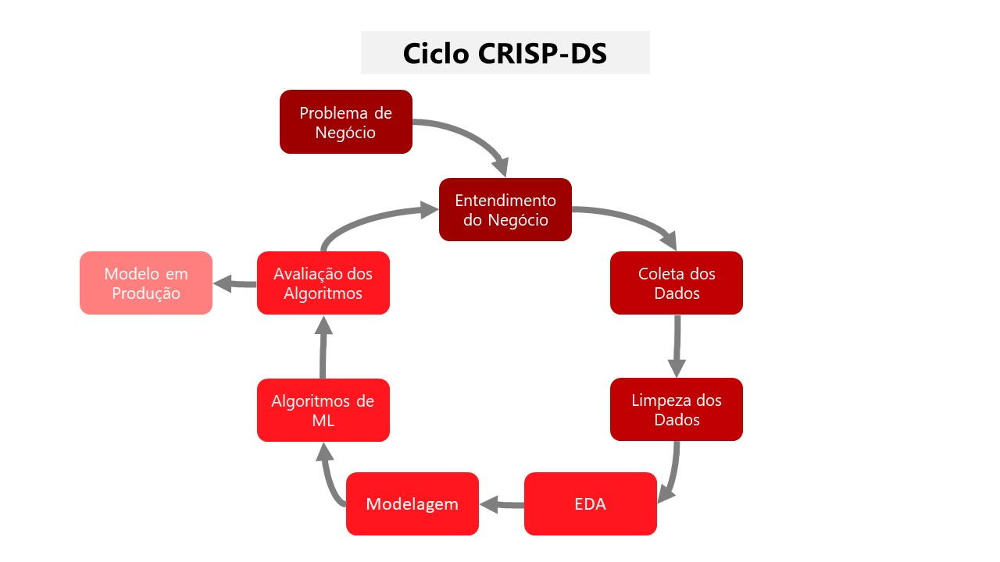

# Estratégia para fidelização de clientes de uma Outlet

# 1. Questão de negócio
A empresa All in One Place (*fictícia*) é uma empresa Outlet Multimarcas, ou seja, ela comercializa produtos de segunda linha de várias marcas a um preço menor, atráves de um e-commerce.

Em pouco mais de 1 ano de operação, o time de marketing percebeu que alguns clientes da sua base compram produtos mais caros, com alta frequência e acabam contribuindo com uma parcela significativa do faturamento da empresa.

Baseado nessa percepção, o time de marketing pretende lançar um programa de fidelidade para os melhores clientes da base, chamado **Insiders**. Contudo, o time não as skills necessárias em análise de dados para eleger os participantes do programa.

Por esse motivo, a equipe de marketing solicitou ao time de dados uma seleção de clientes elegíveis ao programa, usando técnicas avançadas de manipulação de dados.

## 1.1 Desafio

Como Cientista de Dados da All in One Place, o meu objetivo é determinar quais são os clientes elegíveis para participar do programa Insiders. Em posse dessa lista de clientes, o time de marketing poderá realizar um série de ações personalizadas ao grupo, de modo a aumentar o faturamento e frequência de compra.

Como resultado para esse projeto, é esperado que eu entregue uma lista dos clientes elegíveis e um relatório respondendo as seguintes perguntas:

1. **Quais são os clientes elegíveis para participar do programa Insiders?**

2. **Quantos clientes farão parte do grupo?**

3. **Quais as principais características desses clientes?**

4. **Qual a porcentagem de contribuição do faturamento vinda desses clientes?**

5. **Qual a expectativa de faturamento desse grupo para os próximos meses?**

6. **Quais as condições para um cliente ser elegível ao programa?**

7. **Quais as condições para um cliente ser removida dos Insiders?**

8. **Qual a garantia que os clientes do programa Insiders são melhores que o restante da base?**

9. **Quais ações o time de marketing pode realizar para aumentar o faturamento?**

# 2. Premissas de negócio

# 3. Planejamento da solução

## 3.1 Entendimento do negócio:

- **Qual é a propensão de contratação do seguro de automóvel de cada cliente?**
    - **Qual é a motivação?**  
    

    - **Qual é a causa raiz do problema?**  
    

    - **Quem é o dono do problema?**  
   

    - **Qual é o formato da solução?**  
    **Granularidade**:   
    **Tipo de problema**:   
    **Potenciais métodos**:   
    **Produto final**:  

## 3.2 Processo
### 3.2.1 Estratégia da solução
A metodologia utilizada para resolver este problema é a [CRISP-DS](https://blog.magrathealabs.com/crisp-ds-cyclic-methodology-for-data-science-projects-10c7d00fbc85), o objetivo é entregar valor o mais rápido possível para o negócio e melhorar continuamente a solução. A estratégia é detalhada no plano a seguir:

 
 **1 DESCRIÇÃO DOS DADOS**
- Coleta dos dados [Kaggle](https://www.kaggle.com/datasets/carrie1/ecommerce-data)
- Entendimento do significado de cada atributo da base de dados
- Renomeação das colunas, entendimento da dimensão e tipo dos dados
- Tratamento de dados nulos
- Análise dos atributos através de estatística descritiva

 **2 FEATURE ENGINEERING**
- Criação de mapa mental de hipóteses do negócio
- Criação de novas features necessárias para a validação das hipóteses

**3 FILTRAGEM DOS DADOS**
- Filtragem dos registros e atributos de acordo com as restrições do negócio

**4 ANÁLISE EXPLORATÓRIA DE DADOS (EDA)**
- Análise univariada para avaliação dos detalhes de cada atributo, incluse a variável target
- Análise bivariada para validação das hipótestes criadas e geração de insights para o negócio
- Identificação da relevância estimada dos atributos para o aprendizado dos modelos

**5 PREPARAÇÃO DOS DADOS (DATAPREP)**
- Padronização dos atributos numéricos com distribuição normal
- Rescaling dos atributos numéricos com distribuição não normal
- Transformação dos atributos categóricos em atributos numéricos
- Aplicação das transformações realizadas nos dados de teste

**6 FEATURE SELECTION**
- Separaração dos dados em treino e validação
- Aplicação de algoritmo de árvores para obter a sugestão dos atributos mais importantes
- Análise do resultado em conjunto com os atributos relevantes estimados na EDA
- Seleção dos melhores atributos para treinar os modelos de machine learning

**7 MODELOS DE MACHINE LEARNING**
- Aplicação dos algoritmos de classficação: algoritmos utilizados
- Validação cruzadada dos algoritmos
- Mensuração de performance dos modelos
- Comparação das métricas entre os modelos aplicados
- Escolha do algoritmo

**8 OTIMIZAÇÃO DOS HIPERPARÂMETROS**

**9 PERFORMANCE DO MODELO NO NEGÓCIO**
- Respostas das questões de negócio
- Comparação dos resultados do (baseline) com o resultado do modelo escolhido
- Tradução da performance do modelo em resultados financeiros

**10 DEPLOYMENT DO MODELO**

## 3.3 Ferramentas
Quais ferramentas serão utilizadas no processo?
- Python, Numpy, Pandas, Matplotlib, Seaborn
- Anaconda, VSCode, Jupyter Notebook
- Git, GitHub

## 3.4 Dataset
Para responder a pergunta do dono do problema, foi utilizado um *dataset* público disponível no [Kaggle](https://www.kaggle.com/datasets/carrie1/ecommerce-data) com informações sobre a nome da empresa.

| Variável | Definição |
| --- | --- |
| InvoiceNo | Número de identificação único da transação |
| StockCode | Código do item |
| Description | Descrição do item |
| Quantity | A quantidade de cada item comprado por transação |
| InvoiceDate | Data da transação |
| UnitPrice | Preço do produto por unidade |
| CustomerId | Identificador único do cliente |
| Country | O nome do país que o cliente reside |

# 4. Mapa mental de hipóteses
imagem mapa mental de hipóteses

Na etapa de EDA, foram gerados alguns insights ao time de negócio através da validação das hipóteses levantadas.

## 4.1 Top 3 insights do negócio
1. 
**FALSA** 
Insight: 

imagem do gráfico que valida ou invalida hipótese

# 5. Aplicação dos algoritmos de Machine Learning e métricas

Na etapa de Machine Learning, foram utilizados quantidade algoritmos algoritmos tipo do algoritmo> diferentes: nome dos algortimos. Para avaliação do modelo método de avaliação da performance dos modelos.

* **nome do modelo**

* **comparação dos modelos** 

| Model Name | métrica 1 | métrica-n |
| --- | --- | --- |
|  |  |  | 
|  |  |  | 
|  |  |  | 
|  |  |  | 

interpretração das métricas

melhores algoritmos

escolha do algoritmo

aplicação da otimização dos hiperparâmetros

novo resultado do modelo

# 6. Resultados do negócio
Definido o modelo, é possível responder as questões de negócio, criar alguns cenários e estimar o benefício de seguir a solução proposta por esse projeto.

* premissas para cálculo do benefício

## **cenários**:

conclusão

# 7. como o modelo foi colocado em produção

## nome do método

# 8. Próximos passos
Este foi o primeiro ciclo do método CRISP-DS para o problema da nome do problema, foi possível passar por todas as etapas de um projeto completo de Ciência de Dados e entregar valor ao negócio. 

* O que pode ser feito no próximo ciclo?

# 9. Referências

- Este projeto é um desafio da [ComunidadeDS](https://comunidadeds.com/).
- O conjunto de dados foi coletado no [Kaggle][Kaggle](https://www.kaggle.com/datasets/carrie1/ecommerce-data) .

